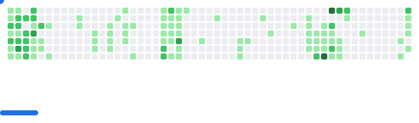

<a target="_blank" href="https://www.qxbao.dev">
  

    
  

</a>

Welcome to my profile. I'm Quan Bao, a Vietnamese passionate software developer.

I do believe that knowledge should always be free, so if you have any questions or need assistance, feel free to reach out!

  
  
  

  
  ## **TECH STACK**

  ## **GITHUB STATS**

  

  ## **CONTRIBUTIONS**

<picture>
  <source
    media="(prefers-color-scheme: dark)"
    srcset="images/breakout-dark.svg"
  />
  <source
    media="(prefers-color-scheme: light)"
    srcset="images/breakout-light.svg"
  />
  
</picture>
